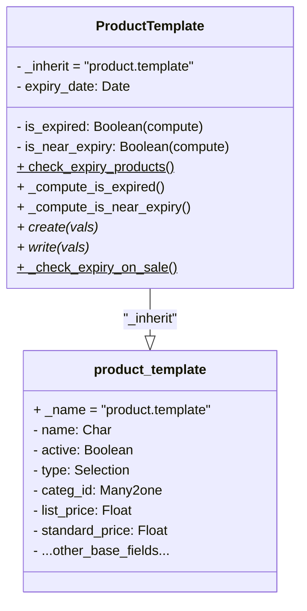

```mermaid
classDiagram
    direction TB
    
    class product_template {
        + _name = "product.template"
        - name: Char
        - active: Boolean
        - type: Selection
        - categ_id: Many2one
        - list_price: Float
        - standard_price: Float
        - ...other_base_fields...
    }

    class ProductTemplate {
        - _inherit = "product.template"
        - expiry_date: Date
        - is_expired: Boolean (compute)
        - is_near_expiry: Boolean (compute)
        
        + check_expiry_products()$
        + _compute_is_expired()
        + _compute_is_near_expiry()
        + create(vals)*
        + write(vals)*
        + _check_expiry_on_sale()$
    }

    ProductTemplate --|> product_template : "_inherit"


```